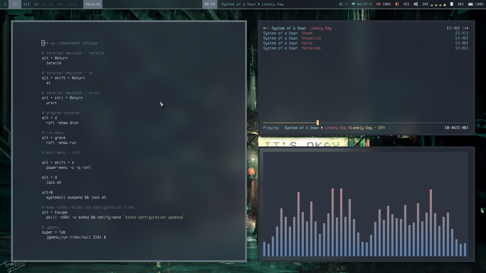
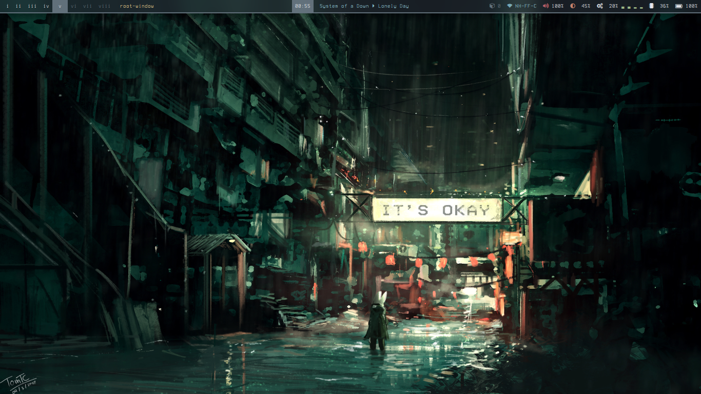

# dotfiles
A (hopefully) neatly maintained repo for my configurations. I use currently bspwm but have added an incomplete set of configs for my i3-gaps setup as well. I believe that might have issues.

### Installation
I'm maintaining these dotfiles using [GNU Stow](https://www.gnu.org/software/stow/). Get it on Arch Linux from the [community repository](https://www.archlinux.org/packages/community/any/stow/). Although most of this should be harmless (hopefully no passwords here!), I'd recommend that the files be examined thoroughly. Edit them to your convenience before installation. These dots can be installed by using the command
```
stow -v -t ~/ common <theme-you-want-installed>
```
Themes currently available are listed below.

### dark-forest
Not sure why I've named it this!

*busy: neovim with Goyo; ncmpcpp and cava*

*clean*

*neovim with Goyo; spotify*


